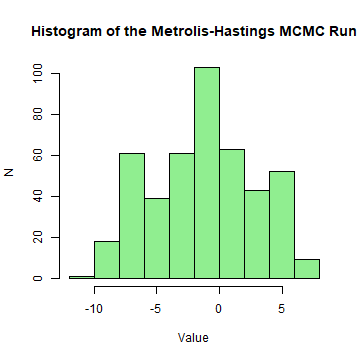
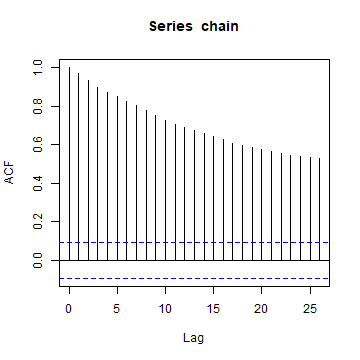

Generating Interactive Markov Chain Monte-Carlo Simulations Using the Metropolis-Hastings Algorithm
========================================================
author: Xiaoran Guo
date: October 25, 2018
transition: concave
autosize: true

So What Do All Those Words Mean?
========================================================
- A "Makov chain" is a model that describes the probability of something happening, but that *something* only depends its current state - in other words, it has no memory of previous results (like flipping a coin).
- A "Monte Carlo simulation" is a simulation method that depends on sampling from a probability distribution in order to get results. For example, if you sampled from an impossibly huge jar of jelly beans, you could eventually guess at the proportions of each colour of jelly beans that are in that jar.
- Metropolis and Hastings are two smart dudes who devised a way to practically take random samples from a probability distribution - even when direct sampling is difficult. Each sample sets up the next one to be closer and closer to the target (called the "posterior") distribution.

Putting It All Together
========================================================

So what does this app do?
- It takes a(n abitrary) proposal probability distribution and walks closer and closer to a target probability density, in tiny steps (both are set to be normal, but they don't have to be!)
- Eventually, it will reach values where the target density is most likely to be and hang around there, walking around with probabilities proportional to the target probability density - in other words, it's describing the shape of that target distribution with its steps.
- What does this mean? It means that you can generate realistic data as long as you know something about the shape of the data, and you can start with just an educated guess!

The Graphs and the Parameters
========================================================

- This is a real run of the simulation with my default parameters. We are "walking" from an arbitrary normal distribution with an initial mean of -10 and a standard deviation of 1 (the proposal function) to a target density that is also normal, with a mean of 0 and a standard deviation of 4. We take 500 steps and disregard the first 50 steps (the "burn-in period") because those first steps are less representative of our target distribution.

<a href ="https://en.wikipedia.org/wiki/Autocorrelation" target="new">The autocorrelation function</a> (on the right), is a measure of how correlated the data is with a time-staggered version of itself. It tells us how much information is available in the entire chain.

Real-World Applications
========================================================

There are various advantages to generating data this way:

- In epidemiology, model population-based exposure to diseases without having a real epidemic happening
- Predicting risk in financial modeling
- Filling out some missing data in a survey to make a decision
- Estimating how a substance behaves in material physics

[Click here to give it a try!](https://xiaoranguo.shinyapps.io/week4/)

Thanks for reading!
